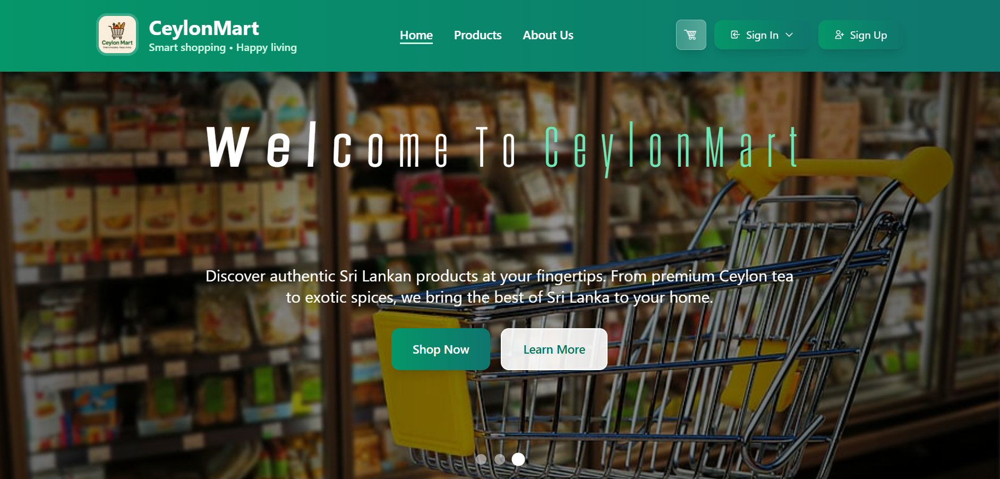

# 🛒 CeylonMart - Online Grocery Management Platform

<p align="center">
  
</p>

CeylonMart is a full-stack MERN-based online grocery e-commerce and management platform designed to streamline grocery shopping, inventory handling, supplier coordination, customer order processing, payment management, and delivery operations within a single integrated system.

The platform provides a modern digital solution for grocery businesses by connecting customers, administrators, inventory managers, suppliers, and delivery personnel through role-based dashboards and management tools.

---

# 🚀 Project Overview

CeylonMart helps manage the complete grocery business workflow from product management to customer delivery. The system allows customers to purchase groceries online while administrators and managers efficiently handle inventory, suppliers, payments, and deliveries.

The platform is designed with secure authentication, responsive user interfaces, real-time management capabilities, and analytics dashboards to improve operational efficiency and customer experience.

---

# ✨ Core Features

- 🔐 Secure JWT Authentication & Role-Based Authorization
- 🛍️ Online Grocery Shopping System
- 📦 Inventory & Stock Management
- 🚚 Delivery Tracking & Driver Management
- 🏪 Supplier Registration & Management
- 💳 Order & Payment Processing
- 📊 Dashboard Analytics & Reporting
- 📧 OTP Email Verification & Notifications
- 📱 Responsive Modern User Interface
- 📄 PDF Report Generation

---

# 👥 User Roles

| Role | Responsibilities |
|------|------------------|
| Admin | Full system management and monitoring |
| Customer | Browse products, place orders, make payments |
| Inventory Manager | Manage products, categories, and stock |
| Supplier Admin | Manage supplier information and requests |
| Delivery Admin | Manage drivers and delivery operations |
| Shop Owner | Oversee grocery business activities |

---

# 🛠️ Technologies Used

## Frontend
- React.js
- Tailwind CSS
- Chart.js

## Backend
- Node.js
- Express.js
- MongoDB
- JWT Authentication

---

# 🧩 System Components

---

# 🔐 User Management Component

The User Management module handles authentication, authorization, user registration, account management, and secure access control for all system users.

## Key Features
- User Registration & Login
- JWT Authentication
- Role-Based Access Control
- OTP Email Verification
- Forgot Password & Reset Password
- Protected Routes
- User Profile Management
- Account Settings Management

### User Functionalities
- Secure user registration and login
- Multi-role access control (Admin, Customer, Inventory Manager, Supplier Admin, Delivery Admin, Shop Owner)
- JWT-based session handling
- Email OTP verification for account activation
- Forgot password and reset password workflow
- Profile information management
- Secure account settings updates
- Route protection based on user roles

---

# 📦 Inventory Management Component

The Inventory Management module is designed to efficiently handle grocery stock operations, product monitoring, reorder management, expiry tracking, and inventory reporting within the CeylonMart platform.

This component helps inventory managers maintain accurate stock levels, monitor product availability, reduce wastage, and streamline inventory-related workflows.

## Key Features
- Product CRUD Operations
- Category Management
- Stock Level Monitoring
- Low Stock Alerts
- Expiry Date Tracking
- Inventory Reports & Analytics
- Stock History Tracking
- Reorder Management System
- Inventory Dashboard
- Sales Trend Analysis

### Inventory Functionalities
- Product inventory management with categories and images
- Real-time low stock monitoring
- Out-of-stock product management
- Restock functionality
- Stock history logging and filtering
- Expiry date alerts and tracking
- PDF and CSV export support
- WhatsApp expiry alert sharing
- Inventory analytics dashboard
- Automated reorder suggestions
- Supplier reorder request management

---

# 🛒 Customer Order & Payment Component

This module handles customer shopping activities including product purchasing, order placement, and payment processing.

## Key Features
- Product Browsing
- Shopping Cart System
- Checkout Process
- Order Placement
- Order Tracking
- Order History
- Multiple Payment Methods
- Payment Status Tracking
- Payment History Management
- Customer Dashboard

### Payment & Order Functionalities
- Secure checkout workflow
- Online payment processing
- Cash on delivery support
- Order confirmation handling
- Customer order tracking
- Payment status updates
- Order history management
- Transaction record maintenance

---

# 🏪 Supplier Management Component

The Supplier Management module manages supplier registration, approval workflows, supplier communication, and supplier information management.

## Key Features
- Supplier Registration
- Supplier Approval Workflow
- Supplier Profile Management
- Supplier Search & Filtering
- Supplier Dashboard
- Admin-Supplier Communication
- Supplier Status Tracking
- Supplier Information Updates

### Supplier Functionalities
- Supplier onboarding system
- Admin approval & rejection workflow
- Supplier information management
- Supplier communication system
- Supplier dashboard access
- Supplier category handling
- Supplier request management

---

# 🚚 Delivery Management Component

The Delivery Management module handles drivers, delivery assignments, order tracking, and delivery confirmation workflows.

## Key Features
- Driver Registration & Management
- Driver Availability Tracking
- Order Assignment System
- Delivery Status Tracking
- Delivery Dashboard
- Driver Dashboard
- District-Based Delivery Handling
- Delivery Confirmation System
- Delivery Analytics & Reports

### Delivery Functionalities
- Delivery driver management
- Real-time driver availability updates
- Delivery assignment workflow
- Delivery progress tracking
- Assigned order management
- Delivery confirmation handling
- District-based delivery operations
- Delivery performance monitoring

---

# 🏗️ System Architecture

CeylonMart follows the MERN stack architecture:

- **Frontend:** React.js with Tailwind CSS
- **Backend:** Node.js & Express.js REST API
- **Database:** MongoDB
- **Authentication:** JWT-based authentication system

The frontend communicates with backend APIs to manage all business operations and data transactions securely.

---

# 📁 Project Structure

```bash
CeylonMart/
│
├── frontend/
│   ├── src/
│   ├── components/
│   ├── pages/
│   └── utils/
│
├── backend/
│   ├── controllers/
│   ├── models/
│   ├── routes/
│   ├── middleware/
│   └── services/
│
└── README.md
```

---

# ⚙️ Installation Guide

## 1️⃣ Clone Repository

```bash
git clone https://github.com/your-username/CeylonMart.git
cd CeylonMart
```

---

## 2️⃣ Backend Setup

```bash
cd backend
npm install
npm start
```

---

## 3️⃣ Frontend Setup

```bash
cd frontend
npm install
npm start
```

---

# 🔑 Environment Variables

Create a `.env` file inside the backend folder.

```env
PORT=5000
MONGO_URI=your_mongodb_connection
JWT_SECRET=your_secret_key
EMAIL_USER=your_email
EMAIL_PASS=your_password
```

---

# 🔒 Security Features

- JWT Authentication
- Password Encryption
- OTP Verification
- Protected Routes
- Role-Based Authorization
- Secure API Access
- Input Validation

---

# 🎨 UI/UX Features

- Responsive Design
- Modern Dashboard Interfaces
- Interactive Charts & Analytics
- Smooth Animations
- Glassmorphism Effects
- Mobile-Friendly Layout
- Real-Time Notifications

---

## 👨‍💻 Development Team

| Team Member | Responsibility |
|------------|-------------------------------|
| W.A.K.Divyanjali | Inventory Management Component |
| S.M.T.K.Samarathunga | Supplier Management Component |
| R.M.T.S.Rathnayake | User Management Component |
| D.J.M.D.C.J.Jayamaha | Customer Order & Payment Component |
| Y.K.M.V.S.Abeyrathnabandara | Delivery Management Component |

---

# 📄 License

This project is developed for educational and academic purposes.

---

# ⭐ Conclusion

CeylonMart provides a complete online grocery e-commerce and management solution that improves operational efficiency, simplifies inventory handling, enhances customer shopping experiences, and supports smooth supplier and delivery management within a centralized platform.

---
